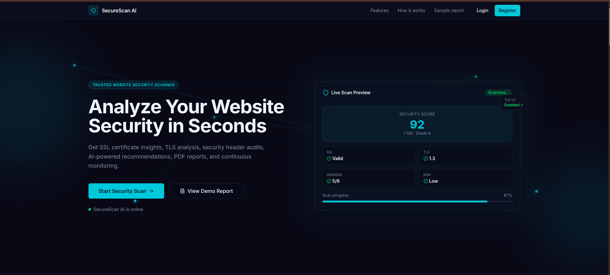
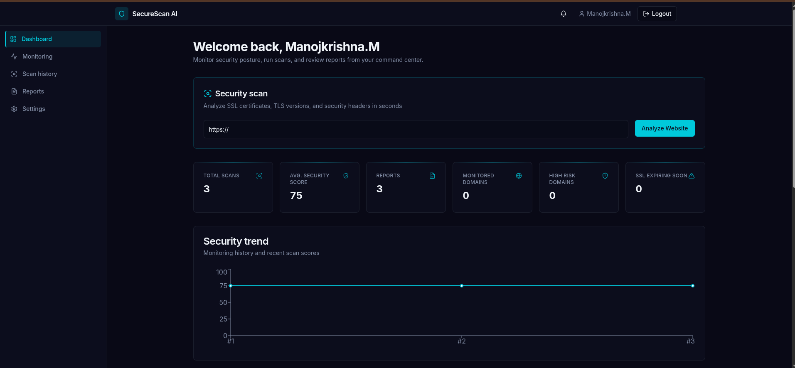
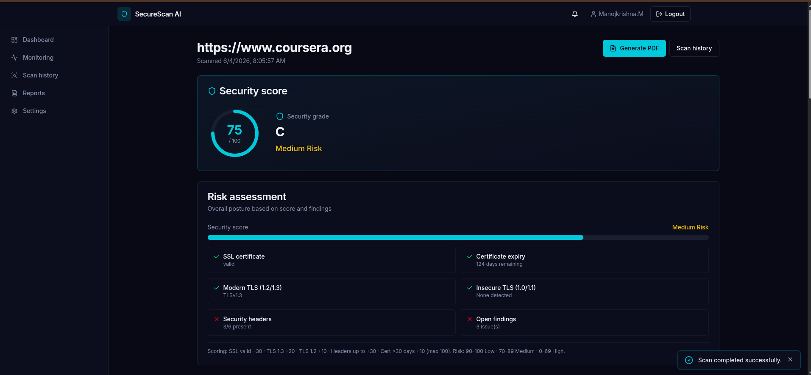
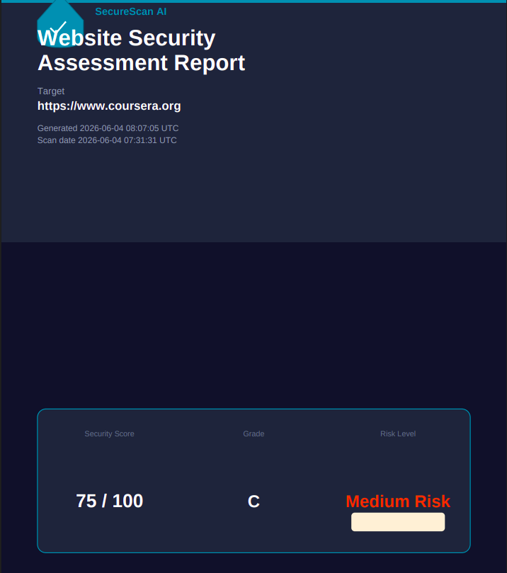
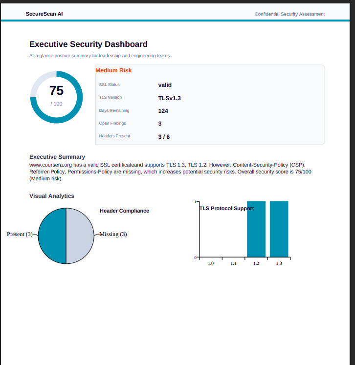
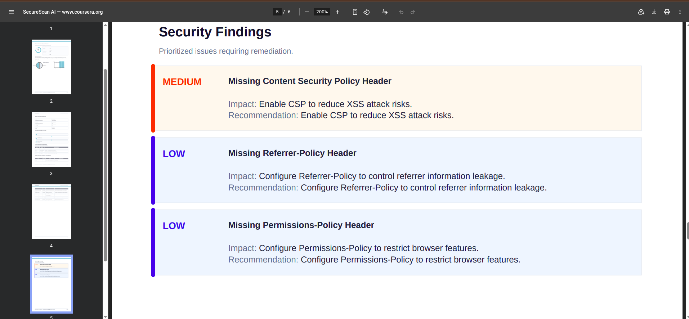

# 🛡️ SecureScan AI

### Intelligent Website Security Assessment Platform

SecureScan AI is a full-stack cybersecurity platform that analyzes website security posture through SSL/TLS inspection, security header analysis, certificate validation, risk scoring, AI-powered recommendations, PDF reporting, and continuous domain monitoring.

---

## 🚀 Features

### Security Analysis

* SSL Certificate Validation
* TLS Version Analysis
* Certificate Chain Verification
* Security Header Inspection
* Risk Assessment & Scoring

### AI Security Auditor

* Automated Security Findings
* Risk Classification
* Remediation Recommendations

### Reporting

* Professional PDF Security Reports
* Security Score Dashboard
* Historical Scan Tracking

### Monitoring

* Domain Monitoring
* SSL Expiry Alerts
* Security Change Detection
* Notification Center

### Administration

* JWT Authentication
* Role-Based Access Control (RBAC)
* Admin Dashboard
* Audit Logs
* Analytics & Insights

---

## 📸 Screenshots

### Landing Page



### Security Dashboard



### Scan Results



### PDF Report




---

## 🏗️ System Architecture

```text
React Frontend
       │
       ▼
 Flask REST API
       │
       ▼
    MySQL
       │
       ▼
 Security Engine
       │
 ┌─────┼─────┐
 │     │     │
 ▼     ▼     ▼
SSL   TLS  Headers
       │
       ▼
 AI Auditor
       │
       ▼
 PDF Reports
```

---

## 🛠️ Tech Stack

### Frontend

* React.js
* Vite
* Tailwind CSS
* Shadcn/UI
* Framer Motion
* Axios
* Recharts

### Backend

* Flask
* SQLAlchemy
* Flask-JWT-Extended
* Flask-Bcrypt
* Flask-CORS

### Database

* MySQL

### Security

* SSL
* Socket
* Cryptography
* Requests

---

## ✨ Key Modules

| Module          | Description                              |
| --------------- | ---------------------------------------- |
| Authentication  | JWT-based user authentication            |
| SSL Scanner     | Certificate validation & expiry analysis |
| TLS Analyzer    | Protocol and cipher inspection           |
| Header Scanner  | Security header verification             |
| AI Auditor      | Risk analysis & recommendations          |
| Monitoring      | Continuous domain monitoring             |
| Reporting       | Professional PDF generation              |
| Admin Dashboard | User management & analytics              |

---

## 📊 Security Score Calculation

| Security Control           | Points |
| -------------------------- | ------ |
| Valid SSL Certificate      | +30    |
| TLS 1.3 Enabled            | +20    |
| TLS 1.2 Enabled            | +10    |
| Security Headers           | +30    |
| Certificate Valid >30 Days | +10    |

Total Score: **100**

---

## ⚙️ Installation

### Backend

```bash
cd backend
python -m venv .venv
source .venv/bin/activate
pip install -r requirements.txt
python app.py
```

### Frontend

```bash
cd frontend
npm install
npm run dev
```

---

## 🔐 Environment Variables

```env
MYSQL_HOST=localhost
MYSQL_PORT=3306
MYSQL_USER=root
MYSQL_PASSWORD=password
MYSQL_DB=securescan

JWT_SECRET_KEY=your_secret_key
```

---

## 🎯 Future Enhancements

* Docker Deployment
* CI/CD Pipeline
* Team Workspaces
* Webhook Integrations
* API Keys
* Historical Trend Analysis

---

## 👨‍💻 Author

**Manojkrishna M**

B.Tech Artificial Intelligence & Data Science

GitHub: https://github.com/Manojkrishna27

LinkedIn: https://www.linkedin.com/in/manoj-krishna-m/
